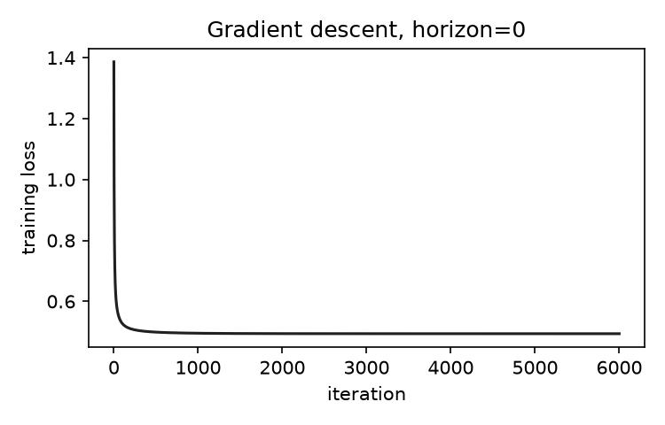
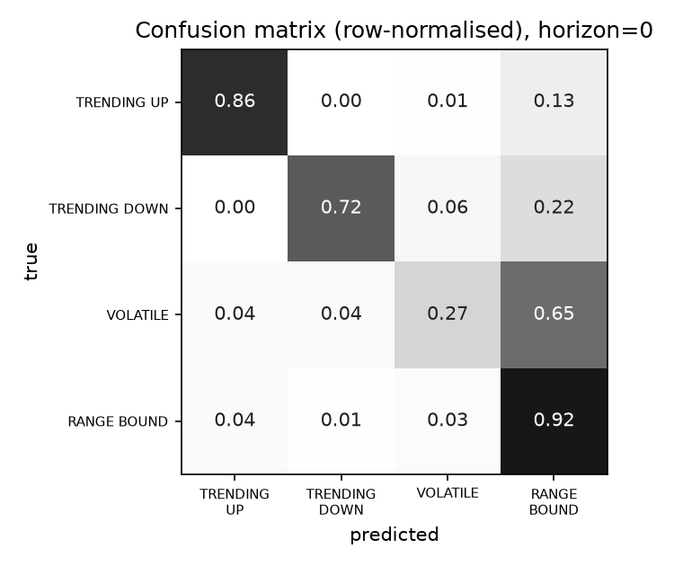
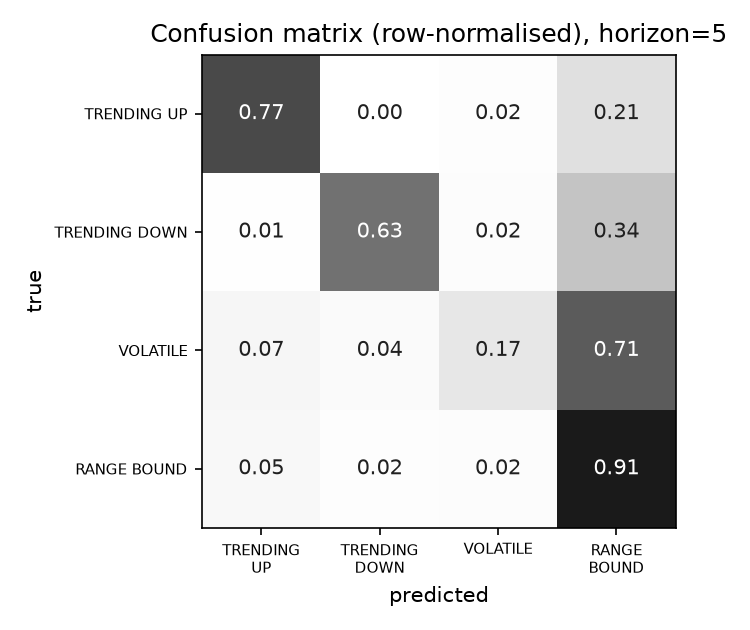

# Results (real market data)

Tickers: 30 | features: 15 | L2 lambda: 0.001 | split: chronological, last 25% of dates = test

## Task: Nowcast: predict TODAY's rule-based regime from features

Train rows: 52,840 (2017-04-12 to 2024-05-16) | Test rows: 15,600 (2024-05-17 to 2026-10-02)

Test class distribution: TRENDING_UP 18.2%, TRENDING_DOWN 7.0%, VOLATILE 18.8%, RANGE_BOUND 55.9%

| Model | Accuracy | Macro-F1 |
|---|---|---|
| Majority class | 0.559 | 0.179 |
| scikit-learn LogReg | 0.772 | 0.705 |
| NumPy softmax (ours) | 0.772 | 0.705 |
| scikit-learn LogReg (balanced) | 0.744 | 0.723 |
| NumPy softmax (ours) (balanced) | 0.744 | 0.723 |

Correctness check, ours vs scikit-learn (same objective): predictions agree on 99.97% of test rows, max probability difference 8.5e-03.

Per-class results, NumPy softmax (unweighted):

| Regime | Precision | Recall | F1 |
|---|---|---|---|
| TRENDING_UP | 0.850 | 0.855 | 0.853 |
| TRENDING_DOWN | 0.785 | 0.716 | 0.749 |
| VOLATILE | 0.677 | 0.269 | 0.385 |
| RANGE_BOUND | 0.760 | 0.921 | 0.833 |

Confusion matrix (rows = true, columns = predicted):

|  | TRENDING_UP | TRENDING_DOWN | VOLATILE | RANGE_BOUND |
|---|---|---|---|---|
| TRENDING_UP | 2434 | 0 | 29 | 383 |
| TRENDING_DOWN | 0 | 781 | 65 | 245 |
| VOLATILE | 107 | 132 | 791 | 1909 |
| RANGE_BOUND | 322 | 82 | 283 | 8037 |

 

## Task: Forecast: predict the regime 5 trading days AHEAD

Train rows: 52,600 (2017-04-12 to 2024-05-06) | Test rows: 15,640 (2024-05-14 to 2026-09-25)

Test class distribution: TRENDING_UP 18.1%, TRENDING_DOWN 7.1%, VOLATILE 18.5%, RANGE_BOUND 56.4%

| Model | Accuracy | Macro-F1 |
|---|---|---|
| Majority class | 0.564 | 0.180 |
| Persistence (today's regime) | 0.763 | 0.727 |
| scikit-learn LogReg | 0.728 | 0.630 |
| NumPy softmax (ours) | 0.727 | 0.630 |
| scikit-learn LogReg (balanced) | 0.669 | 0.640 |
| NumPy softmax (ours) (balanced) | 0.669 | 0.640 |

Correctness check, ours vs scikit-learn (same objective): predictions agree on 99.96% of test rows, max probability difference 5.1e-03.

Per-class results, NumPy softmax (unweighted):

| Regime | Precision | Recall | F1 |
|---|---|---|---|
| TRENDING_UP | 0.758 | 0.770 | 0.764 |
| TRENDING_DOWN | 0.729 | 0.629 | 0.675 |
| VOLATILE | 0.649 | 0.173 | 0.273 |
| RANGE_BOUND | 0.725 | 0.908 | 0.806 |

Confusion matrix (rows = true, columns = predicted):

|  | TRENDING_UP | TRENDING_DOWN | VOLATILE | RANGE_BOUND |
|---|---|---|---|---|
| TRENDING_UP | 2179 | 3 | 51 | 596 |
| TRENDING_DOWN | 6 | 698 | 26 | 379 |
| VOLATILE | 209 | 118 | 500 | 2061 |
| RANGE_BOUND | 480 | 139 | 194 | 8001 |

 
